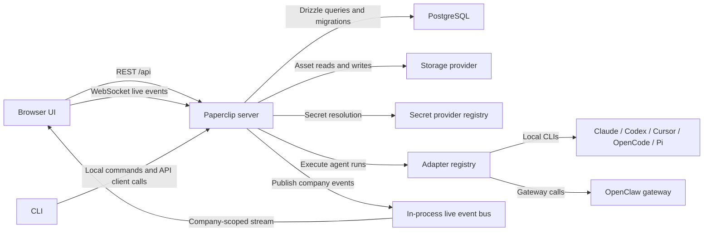
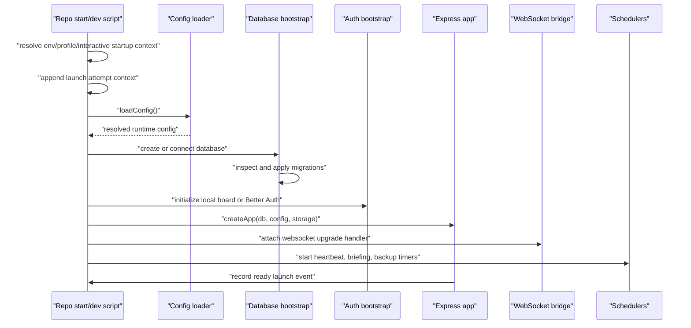
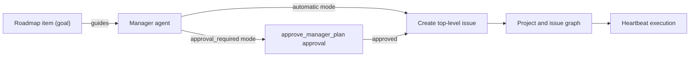
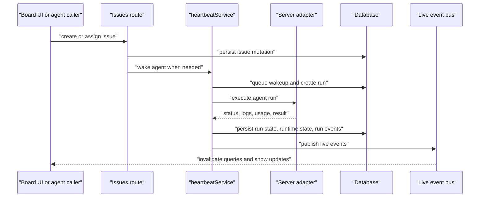
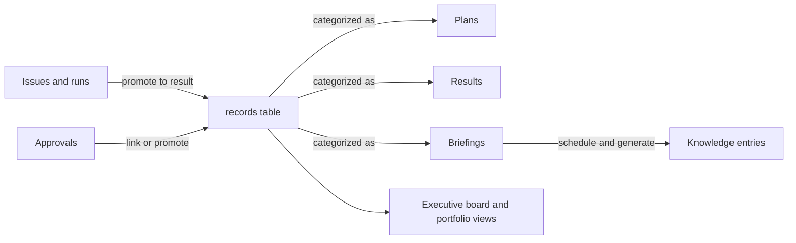
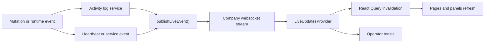

# System Map

Last updated: 2026-03-15

## 1. Purpose

This document explains how the major parts of Paperclip work together.

If `DEV-DOCS/INFRASTRUCURE.md` answers "what exists," this file answers:

- who talks to whom
- where data is transformed
- where state is persisted
- where governance and scoping are enforced
- how operator actions turn into agent work and visible outputs

## 2. Topology Map

## 3. Ownership Map

| Layer | Owns | Depends on |
|---|---|---|
| `packages/shared` | types, enums, validators, API contracts | no higher layer |
| `packages/db` | schema, migrations, DB helpers | `packages/shared` types indirectly through consumers |
| `server` | auth, routes, services, schedulers, orchestration | `packages/db`, `packages/shared`, adapter packages |
| `ui` | operator routes, pages, query wiring, live-event consumption | `packages/shared`, server REST/WS APIs |
| `cli` | onboarding, doctor, run, client-side control-plane commands | config files, server entrypoint, server REST APIs |
| `packages/adapters/*` | adapter-specific execution and environment checks | adapter-utils, local CLIs or gateway endpoints |

## 4. Startup Map

### What this means in practice

- the main server process owns all runtime loops
- there is no separate queue worker or job runner yet
- the database must be ready before auth, routes, or schedulers can do meaningful work
- storage and secrets are resolved before route handlers use them, but they remain provider-backed abstractions
- repo-local startup profiles make the checkout-to-instance mapping explicit instead of silently defaulting to `~/.paperclip`

## 5. Operator Request Map

Most board-origin traffic follows the same path.

### Generic board mutation flow

1. The browser calls a domain API module under `ui/src/api/*`.
2. `ui/src/api/client.ts` sends the request to `/api/...` with cookies included.
3. The server middleware stack resolves the actor:
   - local implicit board in `local_trusted`
   - Better Auth session in `authenticated`
4. The route validates input using shared Zod schemas.
5. The route checks company scope and permissions.
6. The service executes cross-entity logic and writes via Drizzle.
7. Activity logging persists an audit row.
8. The service may publish a live event.
9. The browser invalidates queries and updates visible UI state.

### Why this path matters

This is where correctness is distributed:

- `packages/shared`: request and response contracts
- `server`: scoping, invariants, governance
- `packages/db`: persistence truth
- `ui`: operator language, navigation, and state refresh

## 6. Manager Planning Map

### Detailed flow

1. Operators create or edit roadmap items.
2. Managers read roadmap guidance when no existing issue queue covers the next useful work.
3. The manager's planning mode resolves from:
   - agent override, if present
   - otherwise company default
   - otherwise `automatic`
4. In `automatic` mode, the manager can create top-level issues directly.
5. In `approval_required` mode, the manager must first obtain an approved `approve_manager_plan`.
6. The manager then creates top-level issues with `approvalId`.
7. The issues route enforces that governance rule for agent-authenticated top-level issue creation.

### Key control point

The `issues` route is the narrowest reliable enforcement point because all top-level work creation converges there no matter which adapter or prompt initiated the idea.

## 7. Issue Execution Map

### The actual collaboration path

1. An issue is created, assigned, or woken manually.
2. `heartbeatService` creates or coalesces a wakeup request.
3. When the run starts, the service resolves the best available working directory:
   - workspace checkout
   - project primary workspace
   - task session
   - fallback agent home
4. If the working directory is an isolated repo checkout with `package.json`, the service bootstraps dependencies with the lockfile-matched package manager before local adapter execution.
5. The adapter executes and streams status or logs when supported.
6. For supported local adapters, machine-readable stdout is normalized into structured `heartbeat_run_events`.
7. If the assignee agent hands repo-backed work back as `in_review` or `done`, the issue update includes `reviewSubmission` so the checkout row and handoff comment keep the branch/PR context.
8. The service persists:
   - run rows
   - runtime state
   - task session state
   - run events
   - checkout bootstrap and review-submission metadata
9. Live events notify the UI.
10. The operator sees run activity in issue detail, agent detail, and dashboard surfaces.

## 8. Records and Briefings Map

The record system turns transient work into durable executive outputs.

### Flow details

1. Execution artifacts can be promoted into records.
2. Records persist as durable markdown-backed outputs with links and attachments.
3. Briefing schedules generate recurring record instances.
4. Eligible records can be auto-published into the knowledge library.
5. The dashboard and briefing views roll records back up into operator summaries.

## 9. Asset and Secret Map

### Asset flow

1. UI uploads a file through an asset route.
2. The route validates type and size.
3. The storage service writes to the active provider.
4. Metadata is persisted in the DB.
5. The resulting asset ID is linked to issues or records.

### Secret flow

1. Operator creates or rotates a company secret.
2. Secret metadata and version references persist in DB tables.
3. Agent config stores secret refs, not raw secret values when strict mode is required.
4. At execution time, the secret service resolves the referenced value through the active provider.
5. The adapter receives the resolved env map for the run.

## 10. Realtime Update Map

### Consequence

The UI is not polling every page independently. It still uses React Query for fetches, but the websocket layer tells it when to invalidate and refetch.

## 11. Health and Doctor Map

Two different diagnostic surfaces exist and they complement each other.

### Server health

- `/api/health`
  - answers whether the instance is up and whether bootstrap/auth are ready
- `/api/health/subsystems`
  - answers whether specific subsystems are healthy:
    - database
    - deployment/auth bootstrap
    - `qmd`
    - first-party local adapters

### CLI doctor

`paperclipai doctor` checks the local operator environment:

- config
- deployment/auth mode consistency
- JWT and auth secrets
- secrets provider setup
- storage setup
- database reachability
- LLM access
- log paths
- port availability
- repo-local startup profile selection
- recent launch history for the pinned instance when `--launch-history` is requested

### Relationship between them

- the CLI doctor validates whether the instance can be started correctly and whether the current checkout is pointed at the intended local instance
- the health endpoints validate whether the running instance is healthy now

## 12. Where to Look When Something Breaks

| Symptom | First map hop to inspect | Likely code area |
|---|---|---|
| UI can load but data is missing | Browser -> `/api` -> route -> service -> DB | `ui/src/api/*`, `server/src/routes/*`, `server/src/services/*` |
| Live statuses never update | event producer -> live event bus -> websocket -> provider | `server/src/services/live-events.ts`, `server/src/realtime/live-events-ws.ts`, `ui/src/context/LiveUpdatesProvider.tsx` |
| Agent run starts in the wrong directory | issue/project linkage -> workspace resolution -> heartbeat run | `server/src/services/heartbeat.ts`, `server/src/services/projects.ts` |
| Secret-backed env vars fail | secret ref -> secret service -> provider registry | `server/src/services/secrets.ts`, `server/src/secrets/*` |
| Assets upload but cannot be read back | route -> storage service -> provider | `server/src/routes/assets.ts`, `server/src/storage/*` |
| Roadmap guidance is ignored by managers | roadmap data -> planning mode -> approval enforcement -> issue creation | `server/src/routes/issues.ts`, `server/src/services/agents.ts`, `ui/src/pages/Goals.tsx` |
| Briefings never generate | schedule row -> record service -> knowledge publish | `server/src/services/records.ts`, `server/src/services/knowledge.ts`, `server/src/index.ts` |

## 13. Bottom Line

Paperclip is structurally simple on purpose:

- one main server process
- one browser UI
- one CLI
- one database
- provider-backed storage and secrets
- registry-backed adapters
- company-scoped live events

What makes it feel rich is not infrastructure sprawl. It is the way those few layers are composed:

- shared contracts define the shape
- server services enforce the rules
- the database persists the truth
- adapters execute the work
- records turn work into durable outputs
- the UI and CLI expose the same control plane from different angles
