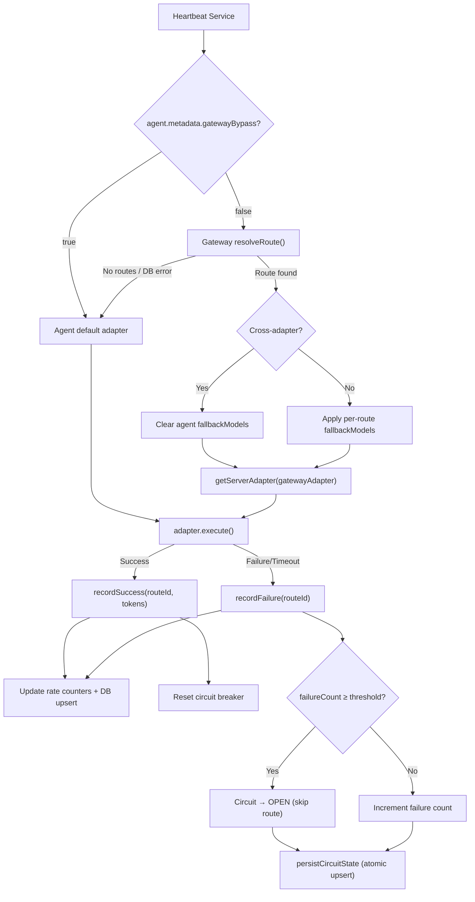

# Paperclip Gateway Routing

## Concepts

**Gateway Routing** is a unified AI model routing layer that sits between the Paperclip task scheduler (Heartbeat) and the actual AI adapters (Gemini, Codex, OpenCode, etc.). It solves a core challenge:

> Every AI vendor imposes unique rate limits and billing policies. When your team runs multiple AI agents, how do you precisely control quota consumption per vendor and automatically fail over when a provider's quota is exhausted?

### How It Works

```
Agent receives a task
    ↓
Gateway checks available routes by priority
    ↓
P10: Gemini CLI (auto) → Quota available ✅ → Execute with Gemini
                          Quota exhausted ❌ → Skip
    ↓
P5:  Codex (gpt-5.3)  → Quota available ✅ → Execute with Codex
                         Circuit open ❌    → Skip
    ↓
P1:  OpenCode (qwen3.6) → Execute with OpenCode
                           → Per-route fallback models kick in if primary model times out
    ↓
All gateway routes exhausted → Fall back to agent's default adapter
```

### Core Capabilities

| Capability | Description |
|---|---|
| **Priority Routing** | Each route has a `priority` value; higher priority routes are tried first |
| **Per-Route Quotas** | Token/request rate limits per minute/hour/day per route |
| **Circuit Breaking** | Auto-skip a route after consecutive failures; background probing for recovery |
| **Weighted Load Balancing** | Multiple routes at the same priority are distributed by `weight` ratio |
| **Cross-Adapter Routing** | A single agent can route across Gemini, Codex, OpenCode, and other adapters |
| **Agent-Specific Preference** | Within the same priority tier, agent-specific routes are preferred over company-wide ones |
| **Per-Route Fallback Models** | Each route can define its own ordered fallback model list |
| **Route-Level Config Overrides** | Override env vars, extra args, thinking effort, max turns per route |
| **Inline Route Editing** | Edit route configuration directly from the route card — no separate dialog needed |

---

## Quick Start

### 1. Configure via UI

1. Sidebar → **Gateway** (company-wide route management)
2. Or navigate to **Agent Detail** → **Gateway** tab (per-agent routes)
3. Click **Add Route**

### 2. Configure via API

```bash
# Create a route
curl -X POST "http://localhost:3100/api/companies/{companyId}/gateway/routes" \
  -H "Content-Type: application/json" \
  -d '{
    "name": "Gemini CLI — Primary",
    "adapterType": "gemini_local",
    "model": "auto",
    "priority": 10,
    "weight": 100,
    "timeoutSec": 300,
    "circuitBreakerEnabled": true,
    "circuitBreakerFailureThreshold": 3,
    "circuitBreakerResetSec": 120,
    "quotaTokensPerHour": 500000,
    "quotaTokensPerDay": 5000000,
    "quotaRequestsPerHour": 30,
    "quotaRequestsPerDay": 200,
    "adapterConfigOverrides": {
      "fallbackModels": ["gemini-2.5-flash", "gemini-2.5-flash-lite"],
      "thinkingEffort": "high"
    }
  }'
```

---

## Configuration Example: Three-Tier Priority Routing

### Tier 1: Gemini CLI (P10 — Primary)

| Parameter | Value | Notes |
|---|---|---|
| adapterType | `gemini_local` | Google Gemini CLI adapter |
| model | `auto` | Auto-select best available model |
| priority | **10** | Highest priority |
| quotaRequestsPerHour | 30 | Max 30 requests/hour |
| quotaRequestsPerDay | 200 | Max 200 requests/day |
| quotaTokensPerHour | 500,000 | 500K tokens/hour |
| quotaTokensPerDay | 5,000,000 | 5M tokens/day |
| circuitBreakerThreshold | 3 | Trip after 3 consecutive failures |

### Tier 2: Codex (P5 — Secondary)

| Parameter | Value | Notes |
|---|---|---|
| adapterType | `codex_local` | OpenAI Codex adapter |
| model | `gpt-5.3-codex` | GPT-5.3 coding model |
| priority | **5** | Medium priority |
| quotaRequestsPerHour | 50 | 50 requests/hour |
| quotaRequestsPerDay | 300 | 300 requests/day |
| quotaTokensPerHour | 800,000 | 800K tokens/hour |
| quotaTokensPerDay | 8,000,000 | 8M tokens/day |

### Tier 3: OpenCode Free (P1 — Last Resort)

| Parameter | Value | Notes |
|---|---|---|
| adapterType | `opencode_local` | OpenCode adapter |
| model | `opencode/qwen3.6-plus-free` | Free model as primary |
| priority | **1** | Lowest priority (last resort) |
| quotaRequestsPerHour | 100 | 100 requests/hour |
| quotaRequestsPerDay | 600 | 600 requests/day |
| quotaTokensPerHour | 2,000,000 | 2M tokens/hour |
| quotaTokensPerDay | 20,000,000 | 20M tokens/day |
| circuitBreakerThreshold | 5 | Higher tolerance (free models can be flaky) |
| fallbackModels | `minimax-m2.5-free`, `gpt-5-nano` | Per-route fallback chain |

> [!TIP]
> Each gateway route can define its own **fallback models** via the `adapterConfigOverrides.fallbackModels` field. When the route's primary model times out or is rate-limited, the adapter retries with these fallback models in order. This is configured per-route rather than per-agent, providing finer-grained control. Gateway routing (cross-adapter) and per-route fallback models (intra-adapter) are two complementary fault-tolerance layers.

---

## Route Resolution Logic

The gateway resolves a route for each heartbeat execution using the following algorithm:

1. **Candidate Pool** — Collect all enabled routes for the agent's company. If the agent has dedicated routes (`agentId` is set), those are merged with company-wide routes (`agentId = null`) into a single pool.

2. **Priority Grouping** — Group candidates by `priority` (descending). Iterate from highest to lowest.

3. **Agent-Specific Preference** — Within each priority tier, if any agent-specific routes are available, only those are considered. Company-wide routes at that tier are skipped. If no agent-specific routes are available (all exhausted/tripped), company-wide routes in the same tier are used.

4. **Availability Check** — Filter for routes that are not quota-exhausted and not circuit-open.

5. **Weighted Random Selection** — Among available candidates at the winning priority tier, select one route using weighted random (`weight` field).

6. **Fallback** — If no route is available at any priority, return `null` and the agent falls back to its default adapter.

---

## Field Reference

| Field | Type | Description |
|---|---|---|
| `name` | string | Display name for the route |
| `adapterType` | string | Adapter type (e.g., `gemini_local`, `codex_local`, `opencode_local`, `claude_local`) |
| `model` | string | Model identifier |
| `priority` | int | Priority level (higher = tried first) |
| `weight` | int | Weight for load balancing among routes at the same priority (default: 100) |
| `isEnabled` | bool | Whether the route is enabled |
| `timeoutSec` | int \| null | Timeout in seconds (overrides agent default) |
| `quotaTokensPerMinute/Hour/Day` | int \| null | Token quota limits |
| `quotaRequestsPerMinute/Hour/Day` | int \| null | Request count limits |
| `circuitBreakerEnabled` | bool | Whether circuit breaking is enabled |
| `circuitBreakerFailureThreshold` | int | Consecutive failures before circuit trips |
| `circuitBreakerResetSec` | int | Cooldown duration after circuit trips (seconds) |
| `agentId` | string \| null | Bind to a specific agent (`null` = company-wide) |
| `adapterConfigOverrides` | object \| null | Per-route adapter config: env vars, extra args, fallback models, thinking effort, max turns |

---

## Monitoring & Operations

### Health Status

```bash
curl http://localhost:3100/api/companies/{companyId}/gateway/health
```

Returns real-time status for each route:
- `circuitState`: `closed` (healthy) / `open` (tripped) / `half_open` (probing)
- `failureCount`: Current consecutive failure count
- `usage.minute/hour/day`: Real-time token and request counters

### Manual Circuit Reset

```bash
curl -X POST http://localhost:3100/api/companies/{companyId}/gateway/routes/{routeId}/reset-circuit
```

---

## Relationship with Legacy Fallback Models

| Mechanism | Scope | Purpose |
|---|---|---|
| **Gateway Routes** | Cross-adapter | Switch between Gemini / Codex / OpenCode by priority |
| **Per-Route Fallback Models** | Within a single adapter | Retry with alternative models when the route's primary model fails |
| **Agent-Level Fallback Models** | Within a single adapter (legacy) | Only active when gateway is disabled for the agent |

When Gateway Routing is active for an agent, the agent-level fallback models configuration in the Agent Detail form is replaced by a blue info banner linking to the Gateway tab, directing users to configure per-route fallback chains instead. Each route can define its own fallback model list specific to its adapter type.

When all gateway routes are exhausted and the agent falls back to its default adapter, the agent-level adapter configuration (including any legacy fallback models) takes effect as the final safety net.

---

## Architecture



---

## Design Notes

- **Transparent by default** — If no gateway routes exist, agents behave exactly as before. Zero config change required for existing setups.
- **Graceful degradation** — If the `gateway_routes` table doesn't exist or a DB error occurs, `resolveRoute` is wrapped in `.catch()` and falls back to the agent's default adapter. A misconfigured deployment will never crash agent execution.
- **In-memory rate limiting** — Sliding window counters are held in memory for low-latency decisions. Snapshots are upserted to DB for observability. Stale rows (>7 days) are purged hourly. Suitable for single-instance deployments; Redis-backed counters would be needed for multi-instance production.
- **Non-invasive UI architecture** — The gateway route form reuses `AdapterTypeDropdown`, `EnvVarEditor`, `TagInput`, and other shared components from the agent config system. Create and edit flows share a single `RouteFormState` interface and `RouteFormFields` component.