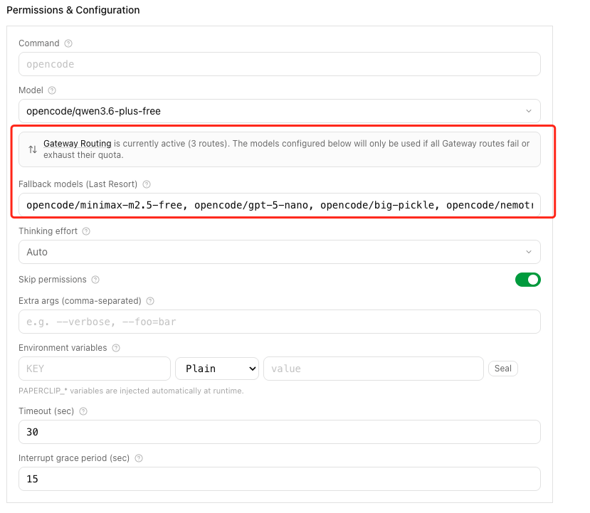
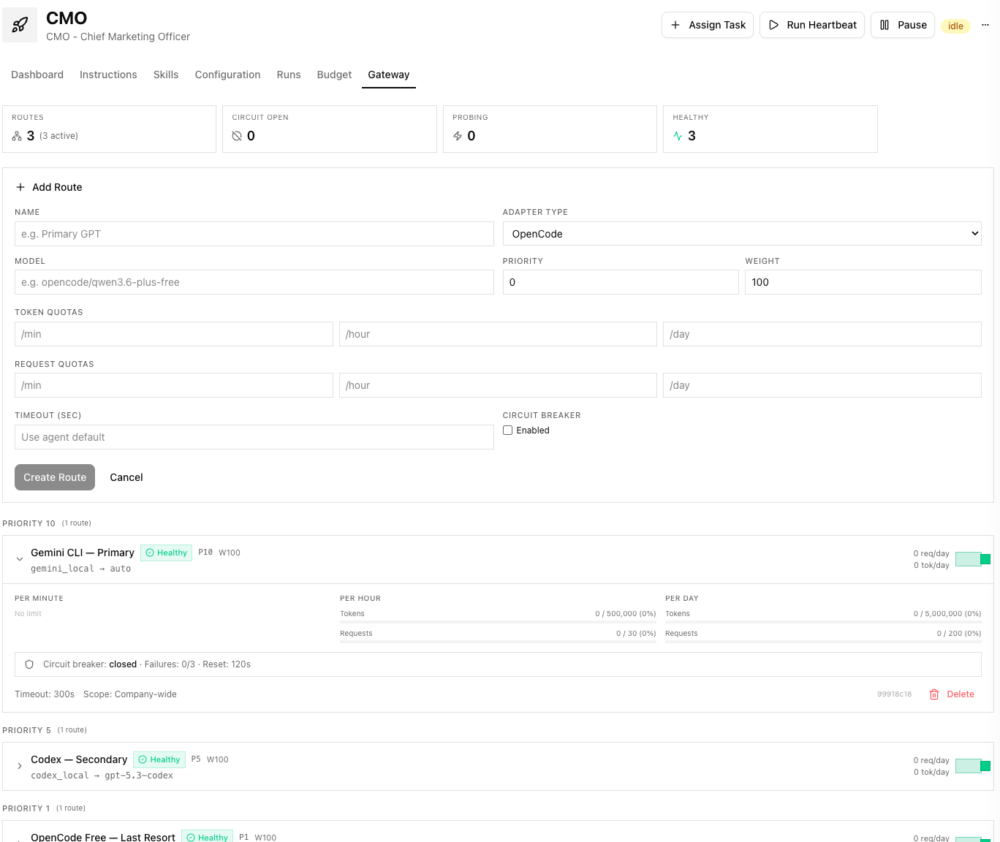

# Paperclip Gateway Routing — 使用指南

## 概念

**Gateway Routing** 是一个统一的 AI 模型路由网关层，插入在 Paperclip 任务调度器（Heartbeat）和实际 AI 适配器（Gemini、Codex、OpenCode 等）之间。它解决了一个核心问题：

> 每家 AI 供应商都有独立的配额限制和计费策略，当你的团队运行多个 AI agent 时，如何精确地控制每个供应商的用量、自动在配额耗尽时切换备用供应商？

### 工作原理

```
Agent 收到任务
    ↓
Gateway 根据优先级检查可用路由
    ↓
P10: Gemini CLI (auto) → 配额充足 ✅ → 使用 Gemini 执行
                         配额耗尽 ❌ → 跳过
    ↓
P5:  Codex (gpt-5.3) → 配额充足 ✅ → 使用 Codex 执行
                        熔断器打开 ❌ → 跳过
    ↓
P1:  OpenCode (qwen3.6) → 使用 OpenCode 执行
                           → 用完后触发 agent 级别的 fallback models
    ↓
所有网关路由耗尽 → 回退到 agent 默认适配器
```

### 核心能力

| 能力 | 说明 |
|---|---|
| **优先级路由** | 每条路由有 `priority` 值，高优先级先尝试 |
| **配额限流** | 每条路由支持 token/request 的 per-minute/hour/day 限制 |
| **熔断器** | 连续失败达阈值后自动跳过，冷却后自动探测恢复 |
| **加权负载均衡** | 同优先级多条路由时，按 `weight` 比例随机分配 |
| **跨适配器路由** | 同一个 agent 可跨越 Gemini/Codex/OpenCode 等不同适配器 |

---

## 快速上手

### 1. 通过 UI 配置

1. 侧边栏 → **Gateway**（公司全局路由管理）
2. 或进入 **Agent Detail** → **Gateway** Tab（单 agent 路由）
3. 点击 **Add Route** 按钮

### 2. 通过 API 配置

```bash
# 创建路由
curl -X POST "http://localhost:3100/api/companies/{companyId}/gateway/routes" \
  -H "Content-Type: application/json" \
  -d '{
    "name": "Gemini CLI — Primary",
    "adapterType": "gemini_local",
    "model": "auto",
    "priority": 10,
    "weight": 100,
    "timeoutSec": 300,
    "circuitBreakerEnabled": true,
    "circuitBreakerFailureThreshold": 3,
    "circuitBreakerResetSec": 120,
    "quotaTokensPerHour": 500000,
    "quotaTokensPerDay": 5000000,
    "quotaRequestsPerHour": 30,
    "quotaRequestsPerDay": 200
  }'
```

---

## 配置示例：三层优先级路由

以下是推荐的 ZetaZeroHub 生产配置：

### 第一优先级：Gemini CLI (P10)

| 参数 | 值 | 说明 |
|---|---|---|
| adapterType | `gemini_local` | Google Gemini CLI 适配器 |
| model | `auto` | 自动选择最优模型 |
| priority | **10** | 最高优先级 |
| quotaRequestsPerHour | 30 | 每小时最多 30 次请求 |
| quotaRequestsPerDay | 200 | 每天最多 200 次 |
| quotaTokensPerHour | 500,000 | 每小时 50 万 token |
| quotaTokensPerDay | 5,000,000 | 每天 500 万 token |
| circuitBreakerThreshold | 3 | 连续 3 次失败触发熔断 |

### 第二优先级：Codex (P5)

| 参数 | 值 | 说明 |
|---|---|---|
| adapterType | `codex_local` | OpenAI Codex 适配器 |
| model | `gpt-5.3-codex` | GPT-5.3 编码模型 |
| priority | **5** | 中等优先级 |
| quotaRequestsPerHour | 50 | 每小时 50 次 |
| quotaRequestsPerDay | 300 | 每天 300 次 |
| quotaTokensPerHour | 800,000 | 每小时 80 万 token |
| quotaTokensPerDay | 8,000,000 | 每天 800 万 token |

### 第三优先级：OpenCode Free (P1) — 兜底

| 参数 | 值 | 说明 |
|---|---|---|
| adapterType | `opencode_local` | OpenCode 适配器 |
| model | `opencode/qwen3.6-plus-free` | 免费模型主力 |
| priority | **1** | 最低优先级（兜底）|
| quotaRequestsPerHour | 100 | 每小时 100 次 |
| quotaRequestsPerDay | 600 | 每天 600 次 |
| quotaTokensPerHour | 2,000,000 | 每小时 200 万 token |
| quotaTokensPerDay | 20,000,000 | 每天 2000 万 token |
| circuitBreakerThreshold | 5 | 宽容度更高（免费模型偶尔不稳） |

> [!TIP]
> OpenCode 兜底路由的 agent 级别仍然配置了 **fallback models**（minimax-m2.5-free, gpt-5-nano 等），当 qwen3.6 本身超时时会在 OpenCode 内部逐个重试。Gateway 路由和 agent fallback 是两层不同的容错机制，可以叠加使用。

---

## 字段说明

| 字段 | 类型 | 说明 |
|---|---|---|
| `name` | string | 路由显示名称 |
| `adapterType` | string | 适配器类型（`gemini_local` / `codex_local` / `opencode_local` / `claude_local`） |
| `model` | string | 模型标识符 |
| `priority` | int | 优先级（数值越大越优先） |
| `weight` | int | 权重（同优先级路由间的负载均衡比例，默认 100） |
| `isEnabled` | bool | 是否启用 |
| `timeoutSec` | int \| null | 超时秒数（覆盖 agent 默认值） |
| `quotaTokensPerMinute/Hour/Day` | int \| null | Token 配额限制 |
| `quotaRequestsPerMinute/Hour/Day` | int \| null | 请求次数限制 |
| `circuitBreakerEnabled` | bool | 是否启用熔断器 |
| `circuitBreakerFailureThreshold` | int | 连续失败多少次后触发熔断 |
| `circuitBreakerResetSec` | int | 熔断后冷却时间（秒） |
| `agentId` | string \| null | 绑定到特定 agent（null = 公司全局） |

---

## 监控与运维

### 健康状态

```bash
curl http://localhost:3100/api/companies/{companyId}/gateway/health
```

返回每条路由的实时状态：
- `circuitState`: `closed` (正常) / `open` (已熔断) / `half_open` (探测中)
- `failureCount`: 当前连续失败次数
- `usage.minute/hour/day`: 实时 token 和请求计数

### 手动重置熔断器

```bash
curl -X POST http://localhost:3100/api/companies/{companyId}/gateway/routes/{routeId}/reset-circuit
```

---

## 与旧版 Fallback Models 的关系

| 机制 | 层级 | 作用 |
|---|---|---|
| **Gateway Routes** | 跨适配器 | 在 Gemini / Codex / OpenCode 之间按优先级切换 |
| **Fallback Models** | 单适配器内 | 同一个适配器内的模型回退（如 qwen3.6 超时后试 minimax） |

当 Gateway 路由配置后，Configuration 页面的 "Fallback models" 输入框会自动隐藏，提示用户前往 Gateway tab 管理。
但 agent 级别已有的 fallbackModels 仍然生效，作为最后兜底。

---

---

# Community Announcement (English)

## 🔀 Exploring a Unified AI Gateway Routing layer for Paperclip

Hi everyone, I've been experimenting with a unified gateway routing layer on a local branch to improve multi-model orchestration.

**The context:** Every vendor imposes unique rate limits and token prices. This is especially challenging when using the OpenCode adapter to access diverse pay-as-you-go aggregators (Alibaba, Volcengine, SiliconFlow, OpenRouter). Managing these requires precise, cost-aware scheduling and transparent cross-provider fallbacks during timeouts.

**Core Design:**
- **Priority-based routing** — Chains like Gemini → Codex → OpenCode. Requests gracefully cascade down if quotas run out or timeouts occur.
- **Granular quotas** — Set precise token/request limits (minute/hour/day) per route.
- **Circuit breaking** — Temporarily isolates failing routes with background recovery probing.
- **Load balancing & UI** — Weight-based traffic distribution and a full dashboard for live quota/circuit monitoring.

**Example scenario:**
```
P10 (Preferred):   Gemini CLI — 30 req/hr
P5  (Fallback):    Codex — 50 req/hr
P1  (Last Resort): OpenCode — 100 req/hr
```

The gateway operates transparently between the task scheduler and adapters. Existing setups work exactly as before with zero config changes. 

Crucially, **it integrates seamlessly with Paperclip's native Budget Management**. Token consumption is accurately captured regardless of which proxy provider is active. I also plan to explore tighter integration between budgets and routing strategies soon.

This approach may offer a more structured way to utilize supplementary free-tier API quotas alongside primary paid providers, or implement stricter routing-level limits decoupled from individual provider dashboards.

I would be very grateful for any feedback or suggestions on this architectural approach. 🚀



