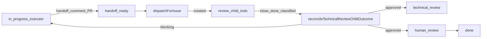

# Agent workflow hardening — investigation and backlog

Date: 2026-04-05  
Status: Investigation complete; implementation tracked in server/UI/docs from this date  
Audience: Operators and engineers maintaining multi-agent review pipelines

## 1. Scope

End-to-end flow between agents for **PR handoff → technical review → parent reconciliation → executor wakes**, plus shared **heartbeat / wakeup** constraints. Canonical code: `server/src/services/review-dispatch.ts`, `server/src/routes/issues.ts` (`classifyTechnicalReviewOutcome`, `reconcileTechnicalReviewChildOutcome`), `server/src/services/heartbeat.ts`.

## 2. Issue status model (shared contract)

Source: [`packages/shared/src/constants.ts`](../../packages/shared/src/constants.ts) — `ISSUE_STATUS_TRANSITIONS`.

| From | Allowed next (subset relevant to agents) |
|------|------------------------------------------|
| `in_progress` | `handoff_ready`, `blocked`, `done`, `cancelled` |
| `handoff_ready` | `in_progress`, `technical_review`, `blocked`, `cancelled` |
| `technical_review` | `changes_requested`, `human_review`, `blocked`, `cancelled` |
| `human_review` | `technical_review`, `changes_requested`, `blocked`, `done`, `cancelled` |

Automated reconciliation also moves parent from `handoff_ready` → `technical_review` → `human_review` when a technical review **child** closes `done` with an **approved** outcome (see `reconcileTechnicalReviewChildOutcome`).

## 3. Call map (dispatch / reconcile / wakes)

### 3.1 `reviewDispatch.dispatchForIssue`

- **Where:** [`server/src/routes/issues.ts`](../../server/src/routes/issues.ts) — after `PATCH` updates an issue; when resulting `issue.status === "handoff_ready"`.
- **Behavior:** Resolves technical reviewer reference (company `technical_reviewer_reference`, then `PAPERCLIP_TECHNICAL_REVIEWER_REFERENCE`, then default `revisor-pr`), resolves PR artifact (GitHub URLs only): work product → same-PATCH `comment` with PR URL → recent comments (handoff/no-new-diff phrases preferred, else newest PR URL) → description; deduplicates by diff identity; may create child issue with `originKind: technical_review_dispatch`.
- **Noop reasons:** `issue_not_found`, `status_not_handoff_ready`, `reviewer_not_found`, `reviewer_ambiguous`, `pull_request_not_found`.
- **Activity:** `issue.review_dispatch_noop` logged for reviewer/PR noops (observability).

### 3.2 `reconcileTechnicalReviewChildOutcome`

- **Where:** [`server/src/routes/issues.ts`](../../server/src/routes/issues.ts) — `try/catch` after issue update; also when dispatch hits `already_reviewed` with child `done`.
- **Approved path:** Advances parent through `handoff_ready` / `technical_review` → `human_review` (unless PR draft defers); may enqueue **merge delegate** wakeup.
- **Blocking path:** `heartbeat.wakeup` executor + `checkout` parent to `in_progress`.
- **Activity:** `issue.merge_delegate_wakeup_failed` when merge-delegate `wakeup` rejects (budget, paused agent, policy).

### 3.3 `reconcileApprovedReviewLane`

- **Where:** Same route file — when patching parent issue toward `human_review` / `done` and latest technical signal is approved.

### 3.4 `queueIssueAssignmentWakeup`

- **Where:** [`server/src/routes/issues.ts`](../../server/src/routes/issues.ts) (review dispatch created/reused), [`server/src/services/routines.ts`](../../server/src/services/routines.ts).
- **Implementation:** [`server/src/services/issue-assignment-wakeup.ts`](../../server/src/services/issue-assignment-wakeup.ts) — `void` fire-and-forget to `heartbeat.wakeup`.

### 3.5 Other `heartbeat.wakeup` (issues context)

- **Where:** [`server/src/routes/issues.ts`](../../server/src/routes/issues.ts) — merged wake map after update (~1656+), manual/agent wake endpoints (~1817, ~2131).

## 4. Coalescing note

[`mergeCoalescedContextSnapshot`](../../server/src/services/heartbeat.ts) shallow-merges `incoming` over `existing`; last write wins per key. `commentId` / `wakeCommentId` are derived from **incoming** when present. Operators should assume **last wakeup in the same task scope overwrites** flat snapshot fields; nested objects are not deep-merged.

## 5. Metrics and SQL (operator)

### 5.1 Heartbeat runs / models

See [2026-04-03-heartbeat-runs-sampling-and-triage.md](./2026-04-03-heartbeat-runs-sampling-and-triage.md):

```sh
export PAPERCLIP_COMPANY_ID='<uuid>'
pnpm audit:heartbeat-runs
pnpm audit:agent-models
```

### 5.2 `agent_wakeup_requests` (skipped / coalesced / failed)

```sql
-- Last 14 days: wakeup outcomes by reason (company-scoped)
SELECT
  a.name AS agent_name,
  r.status,
  COALESCE(r.reason, '(none)') AS reason,
  COUNT(*) AS n
FROM agent_wakeup_requests r
JOIN agents a ON a.id = r.agent_id
WHERE r.company_id = $1
  AND r.requested_at >= NOW() - INTERVAL '14 days'
GROUP BY 1, 2, 3
ORDER BY n DESC;
```

Interpretation:

- `skipped` + `budget.blocked` — executor/reviewer not waking; fix budget or pause policy.
- `skipped` + `heartbeat.wakeOnDemand.disabled` — enable wake-on-demand (or assignment equivalent) for pipeline agents.
- High `coalesced` — multiple wakes merged; confirm `contextSnapshot` still carries the latest `mutation` / `issueId`.

### 5.3 `handoff_ready` without open technical-review child

```sql
SELECT i.id, i.identifier, i.title, i.updated_at
FROM issues i
WHERE i.company_id = $1
  AND i.status = 'handoff_ready'
  AND NOT EXISTS (
    SELECT 1 FROM issues c
    WHERE c.parent_id = i.id
      AND c.origin_kind = 'technical_review_dispatch'
      AND c.status NOT IN ('done', 'cancelled')
      AND c.hidden_at IS NULL
  )
ORDER BY i.updated_at DESC
LIMIT 50;
```

Correlate with `activity_log` for `issue.review_dispatch_noop` (reviewer / PR missing) or missing handoff comment / work product.

## 6. Prioritized backlog (P0 / P1 / P2)

| ID | Severity | Item | Status |
|----|----------|------|--------|
| P0 | Ops | Visible activity when review dispatch noops (reviewer/PR) | Implemented (`issue.review_dispatch_noop`) |
| P0 | Ops | Visible activity when merge-delegate wakeup fails | Implemented (`issue.merge_delegate_wakeup_failed`) |
| P1 | Product | Distinct `reviewer_ambiguous` vs `reviewer_not_found` | Implemented |
| P1 | Product | Configurable reviewer ref (company column + env fallback) | Implemented |
| P1 | Quality | Broader EN phrases for `classifyTechnicalReviewOutcome` | Implemented + matrix doc |
| P2 | Docs | GitHub-only PR URLs — documented in runbook | Implemented |
| P2 | Design | Deep merge or `wakeupHistory` for coalesced snapshots | Documented only (§4) |
| P2 | UI | Surface last wakeup skip on issue/agent detail | Open (dashboard observability extended in plan doc) |

## 7. Definition of done (per item)

- **Behavior change:** unit/route tests + `server/CHANGELOG.md` + operator doc (`docs/guides/board-operator/runtime-runbook.md` or `docs/agents-runtime.md`).
- **Investigation-only:** this doc + [review outcome matrix](./2026-04-05-review-outcome-classification-matrix.md).

## 8. Diagram (logical)


