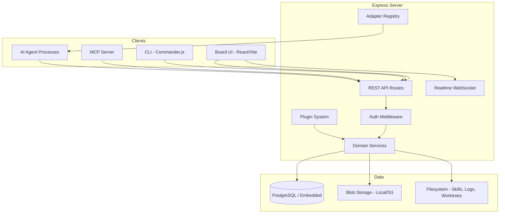
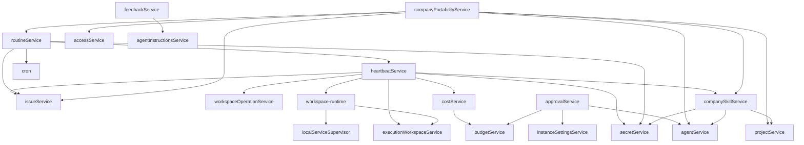
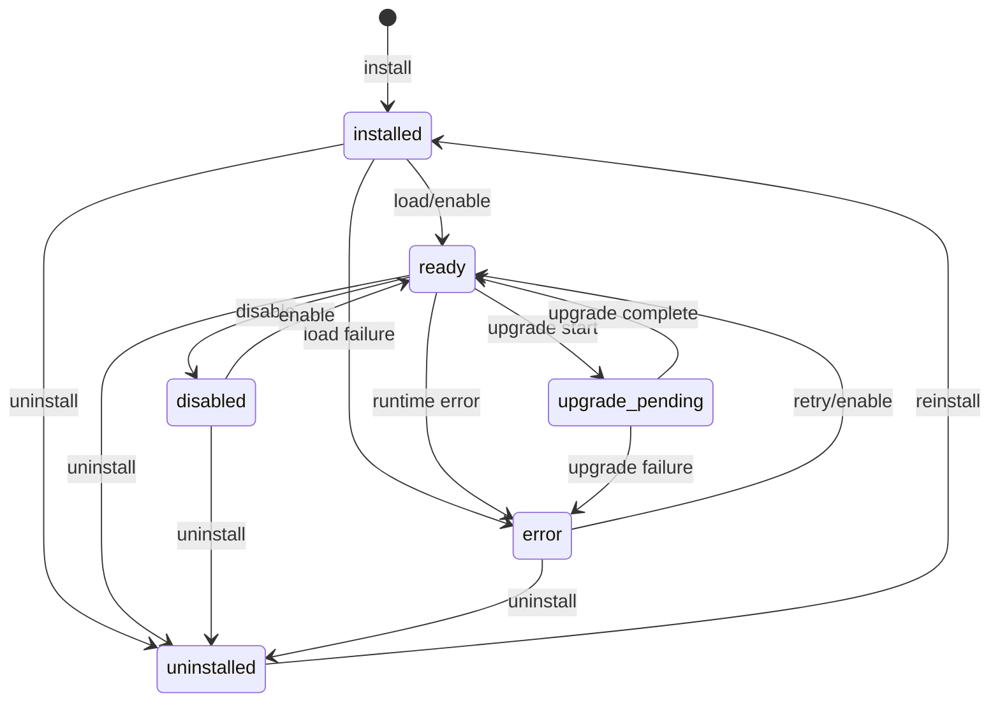
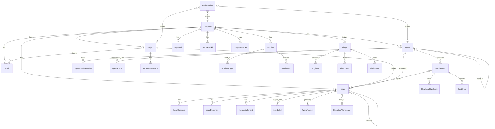
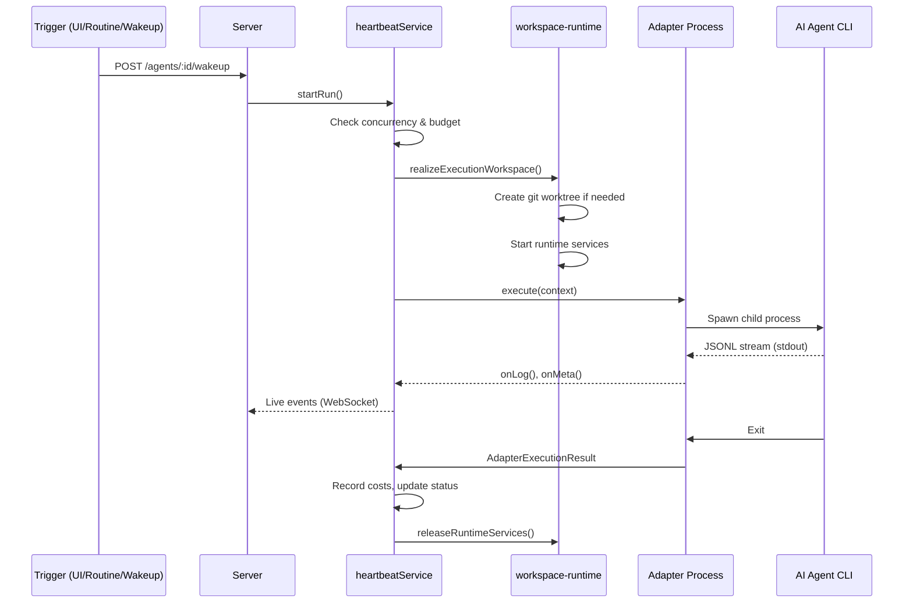
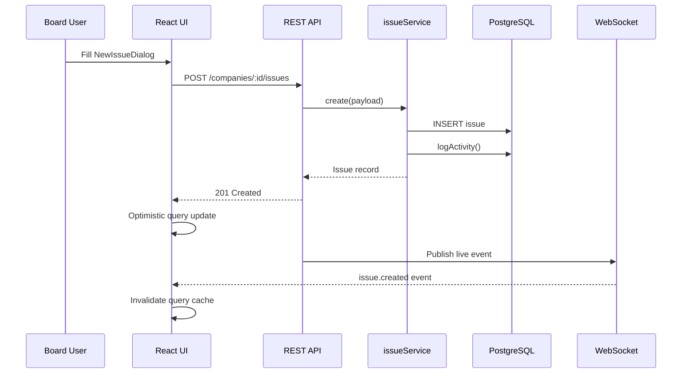

# Codebase Map

> Auto-generated by Cartographer. Last mapped: 2026-04-10

## System Overview

Paperclip is an **AI agent orchestration platform** — a self-hosted control plane for managing teams of AI coding agents (Claude Code, Codex, Cursor, Gemini, OpenCode, Pi) that work on issues across git repositories. It provides a web board UI, CLI, REST API, plugin system, and MCP server.



## Directory Structure

```
tirana/
├── server/src/           # Express API server (749k tokens)
│   ├── services/         # Domain business logic (324k)
│   ├── routes/           # REST API endpoints (135k)
│   ├── __tests__/        # Server test suite (235k)
│   ├── adapters/         # Adapter registry & loader (11k)
│   ├── middleware/        # Auth, CSRF, validation, logging
│   ├── storage/           # Blob storage abstraction (local/S3)
│   ├── auth/              # BetterAuth integration
│   ├── secrets/           # Secret encryption providers
│   └── realtime/          # WebSocket live events
├── ui/src/               # React board UI (709k tokens)
│   ├── components/       # Reusable UI components (285k)
│   ├── pages/            # Route page components (246k)
│   ├── lib/              # Utilities, query keys, filters (84k)
│   ├── api/              # Typed HTTP client modules (17k)
│   ├── adapters/         # UI transcript parsers (20k)
│   ├── context/          # React context providers (15k)
│   ├── hooks/            # Shared React hooks (7k)
│   └── plugins/          # Plugin UI sandboxing (16k)
├── cli/src/              # CLI tool (146k tokens)
│   ├── commands/         # All CLI commands
│   ├── client/           # HTTP client & auth
│   ├── config/           # Config file management
│   ├── checks/           # Health check modules
│   └── adapters/         # CLI adapter registry
├── packages/
│   ├── db/               # Drizzle ORM schema & migrations (916k)
│   ├── shared/           # Shared types, validators, constants (59k)
│   ├── adapters/         # Per-agent adapter packages (134k)
│   │   ├── claude-local/
│   │   ├── codex-local/
│   │   ├── cursor-local/
│   │   ├── gemini-local/
│   │   ├── openclaw-gateway/
│   │   ├── opencode-local/
│   │   └── pi-local/
│   ├── adapter-utils/    # Shared adapter utilities (16k)
│   ├── plugins/
│   │   ├── sdk/          # Plugin authoring SDK (60k)
│   │   ├── examples/     # Example plugins (50k)
│   │   └── create-paperclip-plugin/  # Scaffolding tool (5k)
│   └── mcp-server/       # MCP server for LLM clients (7k)
├── scripts/              # Dev, release, build scripts (69k)
├── docs/                 # User-facing documentation (60k)
├── doc/                  # Internal specs & plans (214k)
└── tests/                # E2E and smoke tests (7k)
```

## Module Guide

### Server — `server/src/`

**Entry point:** `index.ts` → `startServer()` — bootstraps DB, auth, Express app, WebSocket, background workers (heartbeat scheduler, routine cron, backup).

**App assembly:** `app.ts` → `createApp()` — mounts middleware chain, all route modules, plugin infrastructure, static UI serving.

#### Services (`server/src/services/`)

All services use a **factory function pattern**: `serviceName(db: Db)` returns a plain object of async methods. No classes, no DI container. Services compose by calling sibling factories with the same `db`.

| Service | Purpose |
|---------|---------|
| `heartbeat.ts` (35k) | Core agent execution engine — starts/cancels/finishes runs, streams logs, records costs, enforces concurrency |
| `company-portability.ts` (38k) | Import/export full company configs as portable bundles |
| `issues.ts` (20k) | Issue CRUD, comments, labels, relations, execution workspace inheritance |
| `company-skills.ts` (19k) | Shared skill library — import from GitHub/skills.sh, scan projects |
| `workspace-runtime.ts` (18k) | Local runtime service processes (dev servers, DBs) for agent runs |
| `feedback.ts` (16k) | Feedback trace capture and export for Paperclip Labs |
| `routines.ts` (13k) | Scheduled and webhook-triggered automation |
| `budgets.ts` (7k) | Budget policy enforcement — incidents, pause/resume scopes |
| `projects.ts` (7k) | Project and workspace CRUD with goals |
| `agents.ts` (6k) | Agent lifecycle, config revisions, API keys, org chart |
| `agent-instructions.ts` (6k) | Instruction file bundles on disk (managed/external modes) |
| `execution-workspaces.ts` (6k) | Task-specific git worktree records |
| `costs.ts` (4k) | LLM cost recording and analytics |
| `documents.ts` (4k) | Versioned issue documents with optimistic concurrency |
| `issue-execution-policy.ts` (4k) | Pure state machine for multi-stage review/approval |
| `companies.ts` (3k) | Company CRUD with cascading delete |
| `access.ts` (3k) | Authorization — memberships, permissions, instance admin |
| `board-auth.ts` (3k) | Board API keys, CLI auth challenge flow |
| `secrets.ts` (3k) | Company-scoped secret management with versioning |
| `cron.ts` (3k) | Self-contained cron expression parser (used by routines) |
| `approvals.ts` (2k) | Approval workflow orchestration |
| `activity.ts` / `activity-log.ts` | Activity logging and read queries |
| `dashboard.ts` | Company dashboard summary aggregation |
| `finance.ts` | Finance event recording |
| `sidebar-badges.ts` | Aggregated sidebar badge counts |
| `live-events.ts` | Real-time event publishing for WebSocket |
| `hire-hook.ts` | Post-hire lifecycle hook (auto-wakeup, goal assignment) |
| `instance-settings.ts` | Instance-wide settings (general + experimental) |
| `adapter-plugin-store.ts` | External adapter package tracking |
| `github-fetch.ts` | GitHub raw content fetcher for skills/imports |

**Plugin services** (21 files): Full plugin lifecycle system — see [Plugin System](#plugin-system) below.

#### Service Dependency Graph



#### Routes (`server/src/routes/`)

Every route module exports a factory `xxxRoutes(db, opts?)` returning an `express.Router`. All mounted under `/api` in `app.ts`.

| Route | Endpoints | Notes |
|-------|-----------|-------|
| `access.ts` (22k) | Auth, invites, CLI auth, board claim, skills, memberships | Most complex route file |
| `issues.ts` (21k) | Full issue lifecycle, comments, attachments, documents, feedback | 40+ endpoints |
| `agents.ts` (19k) | Agent CRUD, hiring, skills, heartbeat runs, org chart | 40+ endpoints |
| `org-chart-svg.ts` (18k) | Server-side SVG/PNG org chart renderer | No browser dependency |
| `plugins.ts` (17k) | Plugin CRUD, lifecycle, tools, jobs, webhooks, SSE | 25+ endpoints |
| `companies.ts` (3k) | Company CRUD, portability, branding | |
| `adapters.ts` (5k) | Adapter install/uninstall/reload/config | |
| `costs.ts` (3k) | Cost analytics, budget policies | |
| `routines.ts` (3k) | Routines and webhook triggers | |
| `projects.ts` (3k) | Projects and workspaces | |
| `execution-workspaces.ts` (3k) | Execution workspace lifecycle | |
| `assets.ts` (3k) | Image/logo uploads with SVG sanitization | |
| `approvals.ts` (3k) | Approval request lifecycle | |
| `company-skills.ts` (2k) | Company skill library management | |
| `secrets.ts` (1k) | Secret CRUD | |
| `goals.ts` (1k) | Goal CRUD | |
| `health.ts` (1k) | Server health check + bootstrap status | |
| `activity.ts` (1k) | Activity log queries | |
| `llms.ts` (1k) | LLM-readable text docs for agent self-documentation | Mounted on app root, not `/api` |
| `instance-settings.ts` (1k) | Instance-wide settings | |
| `sidebar-badges.ts` (1k) | Sidebar badge aggregation | |
| `authz.ts` | `assertBoard`, `assertInstanceAdmin`, `assertCompanyAccess` | Shared auth helpers |
| `index.ts` | Barrel re-export | |

**Cross-cutting patterns:**
- Two-actor auth: `assertCompanyAccess()` + role/permission check
- `validate(zodSchema)` middleware for request body validation
- `logActivity()` on all mutations
- Secrets normalized before persistence

#### Middleware

| File | Purpose |
|------|---------|
| `auth.ts` | Resolves `req.actor` — local_trusted / BetterAuth session / board API key / agent API key / JWT |
| `board-mutation-guard.ts` | CSRF-like origin check for browser session mutations |
| `validate.ts` | Zod schema body validation |
| `private-hostname-guard.ts` | Hostname allowlist for private deployments |
| `error-handler.ts` | HttpError / ZodError / unhandled → JSON |
| `logger.ts` | Pino HTTP logging |

#### Infrastructure

| Area | Files | Purpose |
|------|-------|---------|
| Storage | `storage/` | Pluggable blob storage (local disk / S3) |
| Auth | `auth/better-auth.ts` | BetterAuth for authenticated mode |
| Secrets | `secrets/` | AES-256-GCM local encryption / external providers |
| Realtime | `realtime/live-events-ws.ts` | WebSocket company event streaming |
| Adapters | `adapters/registry.ts` | In-memory adapter module registry with hot-reload |

### Plugin System

The plugin system spans ~21 service files organized into five layers:

```
Routes (plugins.ts)
  ├── pluginLifecycleManager    ← state machine + events
  │   ├── pluginRegistryService ← DB CRUD
  │   ├── pluginLoader          ← discovery, npm install, activation
  │   └── PluginWorkerManager   ← child_process fork + JSON-RPC over stdio
  │         └── pluginHostServices ← host-side SDK implementations
  ├── PluginToolDispatcher → PluginToolRegistry (in-memory, dual-indexed)
  ├── PluginEventBus (scoped pub/sub, wildcard patterns)
  ├── PluginJobCoordinator → PluginJobScheduler + PluginJobStore
  ├── PluginStreamBus (SSE fan-out)
  ├── pluginStateStore (scoped KV)
  ├── pluginSecretsHandler (SSRF-safe, rate-limited)
  ├── pluginCapabilityValidator (deny-by-default)
  └── pluginDevWatcher (chokidar hot-reload)
```

**Key design:** Process isolation (child_process.fork per plugin), capability-gated operations, lifecycle state machine with typed events, exponential backoff crash recovery.

**Plugin lifecycle state machine:**


### UI — `ui/src/`

**Stack:** React 18, Vite, TanStack Query, React Router v6, shadcn/ui (Radix + Tailwind), @assistant-ui/react, @mdxeditor/editor, lucide-react

**Entry:** `main.tsx` → provider stack → `App.tsx` (routing) → `Layout.tsx` (shell)

#### Key Components

| Component | Purpose |
|-----------|---------|
| `Layout.tsx` | Root shell — CompanyRail + Sidebar + main Outlet + panels + global dialogs |
| `IssueChatThread.tsx` (17k) | AI chat view using @assistant-ui/react with live transcript streaming |
| `NewIssueDialog.tsx` (15k) | Full issue creation modal with draft persistence |
| `AgentConfigForm.tsx` (12k) | Dual-mode agent config form (create/edit) |
| `OnboardingWizard.tsx` (11k) | 4-step first-run setup wizard |
| `MarkdownEditor.tsx` (8k) | Rich markdown editor with @-mention and /slash autocomplete |
| `IssuesList.tsx` (8k) | Filterable/sortable issues table + kanban board |
| `CommentThread.tsx` (8k) | Classic linear comment thread |
| `CommandPalette.tsx` (2k) | Cmd+K global search |
| `transcript/` | Run transcript viewer + live streaming hook |

#### Key Pages

| Page | Route | Purpose |
|------|-------|---------|
| `AgentDetail.tsx` (37k) | `/:prefix/agents/:id` | Agent config, runs, charts, skills, budget |
| `IssueDetail.tsx` (20k) | `/issues/:id` | Issue chat, properties, documents, workspace |
| `Inbox.tsx` (19k) | `/inbox` | Unified inbox — issues, approvals, failures |
| `Costs.tsx` (11k) | `/costs` | Financial dashboard, budget policies |
| `Routines.tsx` (9k) | `/routines` | Scheduled automation list |
| `CompanyImport.tsx` (11k) | `/company/import` | Company package import wizard |
| `CompanyExport.tsx` (9k) | `/company/export` | Company package export wizard |

#### UI Infrastructure

| Area | Purpose |
|------|---------|
| `api/` | Typed HTTP client modules per domain, shared `api` client with cookie auth |
| `lib/queryKeys.ts` | Centralized TanStack Query key factory |
| `lib/router.tsx` | Company-prefix-aware Link/NavLink/Navigate wrappers |
| `context/LiveUpdatesProvider.tsx` | WebSocket → query cache invalidation + toasts |
| `context/CompanyContext.tsx` | Selected company state |
| `plugins/slots.tsx` | Plugin UI sandboxing via blob URL module rewriting |
| `plugins/launchers.tsx` | Plugin launcher stack (modals/drawers/popovers) |
| `adapters/registry.ts` | Transcript parser registry with dynamic external loader |

### CLI — `cli/src/`

**Framework:** Commander.js v13 + @clack/prompts

**Architecture:** Central program tree in `index.ts`. Two command categories:

1. **Local instance management** (direct DB/filesystem):
   - `worktree.ts` (23k) — Full worktree lifecycle (create, init, merge-history, cleanup)
   - `onboard.ts` (5k) — Interactive first-run setup
   - `run.ts` — Bootstrap → doctor → start server
   - `doctor.ts` — Health check runner
   - `env.ts` — Environment introspection
   - `heartbeat-run.ts` — Manual agent run with live streaming
   - `routines.ts` — Direct DB routine management

2. **Client API commands** (HTTP to server):
   - `company.ts` (13k) — Export/import, feedback
   - `issue.ts` — CRUD, checkout/release
   - `agent.ts` — List, get, local-cli bootstrap
   - `approval.ts` — Full approval workflow
   - `feedback.ts` — Trace inspection and export
   - `plugin.ts` — Plugin lifecycle
   - `auth.ts` — Board login/logout/whoami
   - `context.ts` — Named profiles for multi-server

**Auth chain:** `--api-key` → env var → stored board credential → interactive browser challenge

### Packages

#### `packages/db/` — Database

- **Schema:** `src/schema/` — Drizzle ORM `pgTable` definitions for ~50 tables
- **Client:** `src/client.ts` — `createDb(url)`, migration inspection/application/reconciliation
- **Key tables:** companies, agents, issues, issueComments, projects, goals, routines, approvals, costEvents, budgetPolicies, plugins, pluginState, pluginJobs, executionWorkspaces, heartbeatRuns, companySecrets, companySkills, activityLog
- **Migrations:** `src/migrations/` — 53 migration files (NDJSON-framed SQL)

#### `packages/shared/` — Shared Types

Single source of truth for all domain types, Zod validators, API route constants, and utilities shared across all packages.

- **Types:** Company, Agent, Issue, Project, Goal, Plugin, Routine, Approval, Budget, Cost, etc.
- **Constants:** Issue statuses/priorities, agent roles/statuses, plugin capabilities/slot types
- **Validators:** Zod schemas for all API request payloads
- **Utilities:** URL key derivation, @-mention parsing, routine variable interpolation

#### `packages/adapters/` — Agent Adapters

Each adapter integrates with one AI coding agent. All subprocess adapters share common patterns:

| Adapter | Agent | Transport | Skills Target |
|---------|-------|-----------|---------------|
| `claude-local` | Claude Code CLI | Subprocess, JSONL | Ephemeral temp dir via `--add-dir` |
| `codex-local` | OpenAI Codex CLI | Subprocess, JSONL | Managed `CODEX_HOME/skills/` |
| `cursor-local` | Cursor agent CLI | Subprocess, JSONL | `~/.cursor/skills/` |
| `gemini-local` | Gemini CLI | Subprocess, JSONL | `~/.gemini/skills/` |
| `opencode-local` | OpenCode CLI | Subprocess, JSONL | `~/.claude/skills/` |
| `pi-local` | Pi CLI | Subprocess, JSONL | `~/.pi/agent/skills/` |
| `openclaw-gateway` | OpenClaw | WebSocket gateway | N/A |

**Shared patterns:** `buildPaperclipEnv()` env construction, `renderPaperclipWakePrompt()` prompt assembly, `runChildProcess()` execution, session resume/codec, skills symlink injection, `onMeta()` invocation reporting.

#### `packages/adapter-utils/` — Adapter Utilities

Shared foundation: `AdapterExecutionContext`, `AdapterExecutionResult`, `ServerAdapterModule` interface, `runChildProcess()`, `buildPaperclipEnv()`, `renderPaperclipWakePrompt()`, skill symlink helpers, session compaction policies.

#### `packages/plugins/sdk/` — Plugin SDK

Plugin authoring surface: `definePlugin()` factory, all `ctx.*` client interfaces (config, events, jobs, state, entities, http, secrets, tools, data, actions, streams, domain CRUD), JSON-RPC protocol, bundler presets, test harness, dev server, UI bridge hooks.

#### `packages/mcp-server/` — MCP Server

Exposes ~30 Paperclip operations as MCP tools for Claude and other LLM clients. Bearer auth, maps to REST API.

## Domain Model



**Key entity relationships:**
- **Company** is the top-level tenant boundary. All entities are company-scoped.
- **Agent** is an AI worker with an adapter type, role (`ceo|lead|general|support`), budget, and optional `reportsTo` chain.
- **Issue** is the unit of work with status (`backlog|todo|in_progress|in_review|blocked|done|cancelled`), priority (`urgent|high|medium|low|none`), execution policy (multi-stage review/approval gates), and documents.
- **HeartbeatRun** represents one agent execution session — logs, costs, events.
- **ExecutionWorkspace** is an ephemeral git worktree provisioned per task.
- **Plugin** extends the platform with custom tools, UI slots, jobs, events, and webhooks.

## Data Flow

### Agent Run (Heartbeat) Flow



### Issue Creation Flow



## Conventions

### Service Pattern
- Factory functions: `serviceName(db: Db)` returns plain object of async methods
- No classes, no DI container
- Services compose by calling sibling factories with the same `db`
- Module-level `Map`s for in-process state (heartbeat locks, runtime services)

### Route Pattern
- Factory functions: `xxxRoutes(db, opts?)` returns `express.Router`
- Two-tier auth: `assertCompanyAccess()` + role check
- Zod validation middleware: `validate(schema)`
- Activity logging on all mutations

### UI Pattern
- TanStack Query for all server state (30s stale time, refetch on focus)
- WebSocket live updates invalidate query cache by entity type
- React context for cross-cutting state (company, theme, dialog, sidebar, panel)
- localStorage for view preferences, drafts, ordering
- shadcn/ui primitives consistently used everywhere

### Testing
- Vitest for unit/integration tests across all packages
- Playwright for E2E tests
- Plugin SDK provides `createTestHarness()` for in-process testing

## Gotchas

1. **Module-level state:** `heartbeat.ts` and `workspace-runtime.ts` use `Map` singletons for concurrency locks and process tracking — not suitable for multi-process deployments without coordination.

2. **Embedded Postgres:** Default dev/Docker mode uses `embedded-postgres` npm package. The CLI manages its lifecycle (start/stop/PID detection). External `DATABASE_URL` bypasses this.

3. **Worktree instances:** Each git worktree can have its own Paperclip instance (separate port, DB, config). Managed by `cli/src/commands/worktree.ts`. `scripts/provision-worktree.sh` handles automated provisioning.

4. **Plugin sandboxing:** Plugin worker processes communicate via JSON-RPC over stdio. UI plugins are loaded via blob URL module rewriting (bare imports rewritten to host bridge). Not a security sandbox — it's for isolation.

5. **Adapter session resume:** All subprocess adapters track sessions by `(sessionId, cwd)`. Session resume only works if the working directory matches. Unknown-session errors trigger automatic retry with fresh session.

6. **Secret strict mode:** `PAPERCLIP_SECRETS_STRICT_MODE` enforces that sensitive env vars use `secret_ref` objects instead of plaintext. Affects agent configs and approval payloads.

7. **pnpm-lock.yaml:** Owned by CI (`refresh-lockfile.yml`). PRs must not commit changes to it. The `policy` job in `pr.yml` enforces this.

8. **Plugin capabilities:** Deny-by-default. All operations are gated by `pluginCapabilityValidator`. Install-time validation checks manifest features against declared capabilities.

## Development Workflow

**Dev runner:** `scripts/dev-runner.ts` (run via `pnpm dev`) — manages server child process, watches for file changes, handles migration preflight, writes dev-server-status for UI restart banners. Always builds `@paperclipai/plugin-sdk` before starting.

**Key commands:**
| Command | Behavior |
|---------|----------|
| `pnpm dev` | Watch mode — server handles its own file watching |
| `pnpm dev:once` | Dev-runner manages polling + optional auto-restart |
| `pnpm test` | Vitest watch mode |
| `pnpm test:run` | Vitest CI mode |
| `pnpm test:e2e` | Playwright E2E tests |
| `pnpm build` | Recursive build across all workspaces |
| `pnpm -r typecheck` | Recursive type check |
| `pnpm db:generate` | Generate Drizzle migration from schema changes |
| `pnpm db:migrate` | Apply pending migrations |

**Local defaults:** Embedded Postgres (auto-managed), local_disk storage at `~/.paperclip/instances/default/`, AES-256-GCM secret encryption.

## CI/CD Pipeline

**`pr.yml`** — PR checks (on PRs to `master`):
1. `policy` — Blocks manual `pnpm-lock.yaml` edits; validates Dockerfile COPY entries
2. `verify` — `typecheck` + `test:run` + `build` + release dry-run
3. `e2e` — Playwright with Chromium, embedded Postgres, `PAPERCLIP_E2E_SKIP_LLM=true`

**`release.yml`** — Release pipeline:
- **Canary** (push to master): verify → publish to npm with `canary` tag → push `canary/v*` git tag
- **Stable** (workflow_dispatch): verify → publish to npm with `latest` tag → push `v*` git tag → create GitHub Release

**Version scheme:** `YYYY.MDD.P` (e.g., `2026.318.0`). Canary: `YYYY.MDD.P-canary.N`.

**`docker.yml`** — Multi-platform Docker build (`linux/amd64` + `arm64`) → `ghcr.io`

**`refresh-lockfile.yml`** — Auto-regenerates `pnpm-lock.yaml` on master pushes

**Node.js version:** 24 in all CI jobs.

## Docker

**Multi-stage Dockerfile:**
1. `base` — Node LTS + git, ripgrep, gh CLI, gosu
2. `deps` — `pnpm install --frozen-lockfile` (cache layer)
3. `build` — Full build of UI, plugin SDK, server
4. `production` — Installs `claude`, `codex`, `opencode-ai` globally; runs as `node` user

**Docker Compose variants:**
- `docker-compose.yml` — External Postgres 17 + Paperclip server
- `docker-compose.quickstart.yml` — Single container with embedded Postgres

**Production env defaults:** `HOST=0.0.0.0`, `PORT=3100`, `SERVE_UI=true`, `PAPERCLIP_DEPLOYMENT_MODE=authenticated`, `PAPERCLIP_DEPLOYMENT_EXPOSURE=private`

## Configuration Reference

**Config file:** `~/.paperclip/instances/<id>/config.json` (or `.paperclip/config.json` in project)

**Key environment variables:**
| Variable | Purpose | Default |
|----------|---------|---------|
| `DATABASE_URL` | External Postgres connection | (embedded Postgres) |
| `PORT` | Server port | `3100` |
| `SERVE_UI` | Serve UI from API server | `false` (dev), `true` (Docker) |
| `BETTER_AUTH_SECRET` | Auth session secret | Required in production |
| `PAPERCLIP_HOME` | Data home directory | `~/.paperclip` |
| `PAPERCLIP_INSTANCE_ID` | Instance identifier | `default` |
| `PAPERCLIP_DEPLOYMENT_MODE` | `local_trusted` or `authenticated` | `local_trusted` |
| `PAPERCLIP_DEPLOYMENT_EXPOSURE` | `private` or `public` | `private` |
| `PAPERCLIP_SECRETS_STRICT_MODE` | Enforce secret refs for sensitive keys | `false` |
| `PAPERCLIP_AGENT_JWT_SECRET` | JWT signing for agent auth | Auto-generated |
| `ANTHROPIC_API_KEY` | Claude API key | — |
| `OPENAI_API_KEY` | OpenAI/Codex API key | — |

**Deployment modes:**
- `local_trusted` — No auth, single-user, `req.actor` always `local-board` instance admin
- `authenticated` — BetterAuth sessions, API keys, CLI auth challenges, permission system active

**Home directory layout:**
```
~/.paperclip/
  auth.json            # Stored board credentials
  context.json         # Named profiles
  instances/<id>/
    config.json        # Server config
    .env               # Agent JWT secret + runtime vars
    db/                # Embedded Postgres data
    logs/
    data/storage/      # Local blob storage
    data/backups/      # DB backups
    secrets/master.key # AES encryption key
```

## Navigation Guide

**To add a new API endpoint:**
1. Add route handler in `server/src/routes/<domain>.ts`
2. Add service method in `server/src/services/<domain>.ts` if needed
3. Add Zod schema in `packages/shared/src/validators/`
4. Add types in `packages/shared/src/types/`
5. Add API client method in `ui/src/api/<domain>.ts`
6. Add query key in `ui/src/lib/queryKeys.ts`

**To add a new agent adapter:**
1. Create `packages/adapters/<name>-local/` following existing adapter structure
2. Implement `ServerAdapterModule` interface (execute, testEnvironment, etc.)
3. Register in `server/src/adapters/registry.ts`
4. Add session management entry in `packages/adapter-utils/src/session-compaction.ts`
5. Add CLI adapter in `cli/src/adapters/registry.ts`
6. Add UI adapter in `ui/src/adapters/registry.ts`

**To add a new UI page:**
1. Create page component in `ui/src/pages/<PageName>.tsx`
2. Add route in `ui/src/App.tsx`
3. Add nav item in `ui/src/components/Sidebar.tsx` if needed
4. Add query keys in `ui/src/lib/queryKeys.ts`

**To add a new database table:**
1. Define table in `packages/db/src/schema/<domain>.ts`
2. Export from `packages/db/src/schema/index.ts`
3. Run `pnpm db:generate` to create migration
4. Add types in `packages/shared/src/types/`
5. Add service methods in `server/src/services/`
6. Run `pnpm -r typecheck` to verify

**To create a new plugin:**
1. Run `npx create-paperclip-plugin` or copy from `packages/plugins/examples/`
2. Implement `definePlugin({ setup })` in `worker.ts`
3. Declare capabilities in `manifest.ts`
4. Build with SDK bundler presets
5. Install via CLI (`paperclipai plugin install <path>`) or UI

**To modify auth/access:**
1. Auth middleware: `server/src/middleware/auth.ts`
2. Permission checks: `server/src/services/access.ts`
3. Route guards: `server/src/routes/authz.ts`
4. Board auth flow: `cli/src/client/board-auth.ts`
