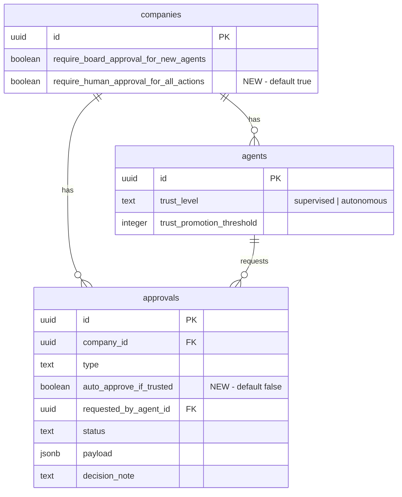

# feat: General action approvals with trust-based auto-approval

## Overview

Expand the approval system so agents can request human approval for **any action** — not just hiring agents or CEO strategies. Add a new `action` approval type with trust-based auto-approval: if an agent is `autonomous`, opts in via `autoApproveIfTrusted`, and the company allows it, the approval resolves immediately. Otherwise it stays pending for human review.

Also: absorb PR #348's generic payload renderer (with bug fixes), add agent wakeup on rejection/revision (existing gap), and add a company settings toggle.

## Problem Statement

The trust infrastructure (auto-promote after 20 successes, auto-demote after 3 failures) is built but only gates `hire_agent` approvals. Agents that want to send emails, publish posts, or execute strategies have no native way to request approval. The approval type enum rejects anything outside `hire_agent` and `approve_ceo_strategy`.

## Proposed Solution

1. Add `"action"` to `APPROVAL_TYPES` enum
2. Add `autoApproveIfTrusted` boolean column to approvals table
3. Add `requireHumanApprovalForAllActions` boolean to companies table
4. Wire auto-approval logic in `approvalService.create()`
5. Add agent wakeup on rejection and revision-requested (fixes existing gap for all types)
6. Absorb PR #348's generic payload renderer with bug fixes
7. Add `action` type label/icon to UI and auto-approved indicator
8. Add company settings toggle

## Technical Approach

### Phase 1: Shared Package + Database Schema

#### 1a. Constants (`packages/shared/src/constants.ts:152`)

Add `"action"` to the approval types array:

```ts
export const APPROVAL_TYPES = ["hire_agent", "approve_ceo_strategy", "action"] as const;
```

#### 1b. Approval Validator (`packages/shared/src/validators/approval.ts:4-11`)

Add `autoApproveIfTrusted` to `createApprovalSchema`:

```ts
export const createApprovalSchema = z.object({
  type: z.enum(APPROVAL_TYPES),
  requestedByAgentId: z.string().uuid().optional().nullable(),
  payload: z.record(z.unknown()),
  issueIds: z.array(z.string().uuid()).optional(),
  autoApproveIfTrusted: z.boolean().optional().default(false),
});
```

#### 1c. Approval Type (`packages/shared/src/types/approval.ts:3-16`)

Add `autoApproveIfTrusted` to the `Approval` interface:

```ts
export interface Approval {
  // ... existing fields ...
  autoApproveIfTrusted: boolean;
}
```

#### 1d. Company Type (`packages/shared/src/types/company.ts:12`)

Add after `requireBoardApprovalForNewAgents`:

```ts
requireHumanApprovalForAllActions: boolean;
```

#### 1e. Company Validator (`packages/shared/src/validators/company.ts:17`)

Add to `updateCompanySchema`:

```ts
requireHumanApprovalForAllActions: z.boolean().optional(),
```

#### 1f. DB Schema — Approvals (`packages/db/src/schema/approvals.ts`)

Add column after `payload`:

```ts
autoApproveIfTrusted: boolean("auto_approve_if_trusted").notNull().default(false),
```

#### 1g. DB Schema — Companies (`packages/db/src/schema/companies.ts`)

Add column after `requireBoardApprovalForNewAgents`:

```ts
requireHumanApprovalForAllActions: boolean("require_human_approval_for_all_actions")
  .notNull()
  .default(true),
```

#### 1h. Generate Migration

```bash
cd packages/db && pnpm generate
```

This produces a single migration adding both columns. Default `true` for the company toggle means auto-approval is opt-in (safety first).



### Phase 2: Service Layer

#### 2a. Auto-approval logic (`server/src/services/approvals.ts`)

Extend `create()` to handle `action` auto-approval after the existing `hire_agent` block (line 118). The pattern mirrors the existing hire_agent auto-approve but adds the company toggle check:

```ts
// After existing hire_agent auto-approve block (line 118):

// Auto-approve action type if conditions are met
if (
  approval.type === "action" &&
  approval.autoApproveIfTrusted &&
  data.requestedByAgentId
) {
  const requester = await agentsSvc.getById(data.requestedByAgentId);
  if (requester?.companyId === companyId && requester.trustLevel === "autonomous") {
    // Check company toggle
    const company = await db
      .select({ requireHumanApprovalForAllActions: companies.requireHumanApprovalForAllActions })
      .from(companies)
      .where(eq(companies.id, companyId))
      .then((rows) => rows[0]);

    if (company && !company.requireHumanApprovalForAllActions) {
      const approved = await approve(approval.id, null, "Auto-approved: autonomous trust level");
      await logActivity(db, {
        companyId,
        actorType: "system",
        actorId: data.requestedByAgentId,
        agentId: data.requestedByAgentId,
        action: "approval.approved",
        entityType: "approval",
        entityId: approved.id,
        details: {
          type: approved.type,
          trigger: "trust_auto_approve",
          requestedByAgentId: data.requestedByAgentId,
        },
      });
      return approved;
    }
  }
}
```

Import `companies` from `@paperclipai/db` and `eq` is already imported.

**Key behaviors:**
- `action` type has NO side-effects on approve/reject (unlike `hire_agent` which activates/terminates agents)
- Auto-approved approvals return with `status: "approved"` — agent adapter checks this to decide whether to proceed or yield
- Resubmission does NOT re-trigger auto-approval (resubmit goes directly to `pending` via a different code path)

#### 2b. Agent wakeup on rejection and revision-requested (`server/src/routes/approvals.ts`)

**This fixes an existing gap for ALL approval types, not just `action`.**

After the reject route's `logActivity` call (line 222), add wakeup logic mirroring the approve handler (lines 143-204):

```ts
// In reject handler, after logActivity (line 222):
if (approval.requestedByAgentId) {
  try {
    await heartbeat.wakeup(approval.requestedByAgentId, {
      source: "automation",
      triggerDetail: "system",
      reason: "approval_rejected",
      payload: {
        approvalId: approval.id,
        approvalStatus: approval.status,
      },
      requestedByActorType: "user",
      requestedByActorId: req.actor.userId ?? "board",
      contextSnapshot: {
        source: "approval.rejected",
        approvalId: approval.id,
        approvalStatus: approval.status,
        wakeReason: "approval_rejected",
      },
    });
  } catch (err) {
    logger.warn(
      { err, approvalId: approval.id, requestedByAgentId: approval.requestedByAgentId },
      "failed to queue requester wakeup after rejection",
    );
  }
}
```

Same pattern for request-revision handler (after line 247), with `reason: "approval_revision_requested"`.

### Phase 3: UI — Generic Payload Renderer (Absorb PR #348)

#### 3a. Replace `CeoStrategyPayload` with `GenericPayload` (`ui/src/components/ApprovalPayload.tsx`)

Absorb PR #348's approach with the following bug fixes applied:

1. **Falsy guard fix**: `if (!value) return null` → `if (value == null) return null` (preserves `0` and `false`)
2. **Clipboard guard**: `navigator.clipboard?.writeText(text).catch(() => {})` (HTTP context safety)
3. **Label formatting**: Capitalize first letter in `formatLabel`

Add `action` to the type maps:

```ts
import { UserPlus, Lightbulb, Play, ShieldCheck } from "lucide-react";

export const typeLabel: Record<string, string> = {
  hire_agent: "Hire Agent",
  approve_ceo_strategy: "CEO Strategy",
  action: "Action",
};

export const typeIcon: Record<string, typeof UserPlus> = {
  hire_agent: UserPlus,
  approve_ceo_strategy: Lightbulb,
  action: Play,
};
```

The `GenericPayload` component introspects payload values:
- **String arrays** → copyable card list
- **Long strings** (>80 chars) → scrollable text block
- **Short scalars** → inline key-value
- **Objects/nested arrays** → formatted JSON

`ApprovalPayloadRenderer` dispatch:
```ts
export function ApprovalPayloadRenderer({ type, payload }: { type: string; payload: Record<string, unknown> }) {
  if (type === "hire_agent") return <HireAgentPayload payload={payload} />;
  return <GenericPayload payload={payload} />;
}
```

#### 3b. Auto-approved indicator (`ui/src/components/ApprovalCard.tsx`)

Show an "Auto-approved" badge next to the status when `approval.decisionNote` includes "Auto-approved" and status is `approved`:

```tsx
{approval.status === "approved" && approval.decisionNote?.startsWith("Auto-approved") && (
  <span className="text-[10px] font-medium text-emerald-600 dark:text-emerald-400 bg-emerald-50 dark:bg-emerald-900/30 px-1.5 py-0.5 rounded">
    Auto
  </span>
)}
```

Same indicator on `ApprovalDetail.tsx` near the status badge.

### Phase 4: Company Settings UI

#### 4a. Add toggle (`ui/src/pages/CompanySettings.tsx`)

Add a new "Approvals" section after the "Hiring" section (line 308), following the exact same pattern:

```tsx
{/* Approvals */}
<div className="space-y-4">
  <div className="text-xs font-medium text-muted-foreground uppercase tracking-wide">
    Approvals
  </div>
  <div className="rounded-md border border-border px-4 py-3">
    <ToggleField
      label="Require human approval for all agent actions"
      hint="When enabled, agents cannot auto-approve actions even if they have autonomous trust level."
      checked={!!selectedCompany.requireHumanApprovalForAllActions}
      onChange={(v) => actionApprovalMutation.mutate(v)}
    />
  </div>
</div>
```

Add a mutation (matching `settingsMutation` pattern at line 68):

```ts
const actionApprovalMutation = useMutation({
  mutationFn: (requireHuman: boolean) =>
    companiesApi.update(selectedCompanyId!, {
      requireHumanApprovalForAllActions: requireHuman
    }),
  onSuccess: () => {
    queryClient.invalidateQueries({ queryKey: queryKeys.companies.all });
  }
});
```

## Acceptance Criteria

### Functional Requirements

- [x] Agents can create approvals with `type: "action"` and freeform JSONB payload
- [x] `autoApproveIfTrusted: true` + `autonomous` trust + company allows it → auto-approved immediately
- [x] `autoApproveIfTrusted: true` + `supervised` trust → stays `pending`
- [x] `autoApproveIfTrusted: true` + company toggle on → stays `pending`
- [x] `autoApproveIfTrusted: false` → always stays `pending` regardless of trust
- [x] Company setting `requireHumanApprovalForAllActions` defaults to `true` (safe default)
- [x] Auto-approved approvals show "Auto" badge in UI
- [x] Generic payload renderer displays any JSONB shape intelligently
- [x] Agents are woken up on rejection and revision-requested (all types, not just `action`)
- [x] Existing `hire_agent` and `approve_ceo_strategy` flows unchanged
- [x] Notifications fire for `approval.created` (when not auto-approved) and `approval.decided` (always)

### Non-Functional Requirements

- [x] No breaking changes to existing API contracts
- [x] `action` type has no side-effects on approve/reject (unlike `hire_agent`)
- [x] Cross-company spoofing check: requester must belong to the same company

## Files to Modify

| File | Change |
|------|--------|
| `packages/shared/src/constants.ts` | Add `"action"` to `APPROVAL_TYPES` |
| `packages/shared/src/validators/approval.ts` | Add `autoApproveIfTrusted` to `createApprovalSchema` |
| `packages/shared/src/types/approval.ts` | Add `autoApproveIfTrusted` to `Approval` interface |
| `packages/shared/src/types/company.ts` | Add `requireHumanApprovalForAllActions` |
| `packages/shared/src/validators/company.ts` | Add to `updateCompanySchema` |
| `packages/db/src/schema/approvals.ts` | Add `autoApproveIfTrusted` column |
| `packages/db/src/schema/companies.ts` | Add `requireHumanApprovalForAllActions` column |
| `server/src/services/approvals.ts` | Auto-approval logic for `action` type |
| `server/src/routes/approvals.ts` | Agent wakeup on reject + revision-requested |
| `ui/src/components/ApprovalPayload.tsx` | Generic renderer, `action` label/icon, falsy guard fix |
| `ui/src/components/ApprovalCard.tsx` | Auto-approved indicator |
| `ui/src/pages/ApprovalDetail.tsx` | Auto-approved indicator |
| `ui/src/pages/CompanySettings.tsx` | `requireHumanApprovalForAllActions` toggle |

**Migration generated by drizzle-kit** (not hand-authored).

## Design Decisions

| Decision | Choice | Rationale |
|----------|--------|-----------|
| Approval type model | Add `"action"` to enum (keep existing types) | Existing types have special side-effect handlers; `action` is the catch-all |
| Auto-approve flag | Column on approvals table | Queryable, auditable, first-class attribute |
| Payload structure | Freeform JSONB | Maximum flexibility; generic renderer handles display |
| Trust granularity | Agent opts in per-request | Agent knows its own action context; no per-category policy needed |
| Company override | `requireHumanApprovalForAllActions` (default `true`) | Safety net; consistent with existing `requireBoardApprovalForNewAgents` |
| Resubmission auto-approve | No | Resubmit goes through separate code path; keeps behavior simple |
| Hire_agent refactor | Leave as-is | YAGNI; two separate auto-approve paths is fine for now |

## Open Questions (Resolved)

1. **Auto-approved visibility** → Show in list with "Auto" badge. Auditability matters.
2. **Naming** → `requireHumanApprovalForAllActions` follows existing pattern.
3. **Refactor hire_agent auto-approve?** → No, leave as-is for this iteration.

## Related PRs

| PR | Relationship |
|----|-------------|
| #348 | Absorbed — generic payload renderer |
| #303 | Superseded by notification channels (#389) |
| #382 | Trust levels (current work) |
| #389 | Notification channels (current branch) |
