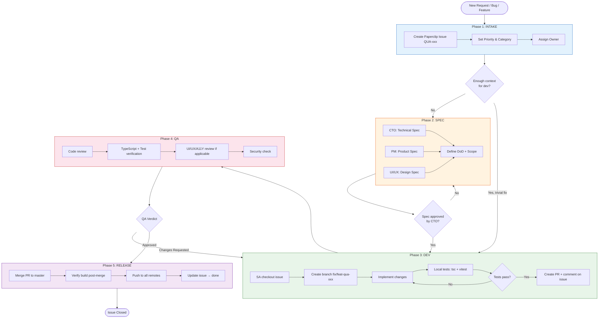
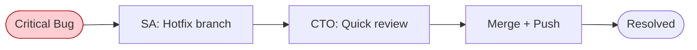
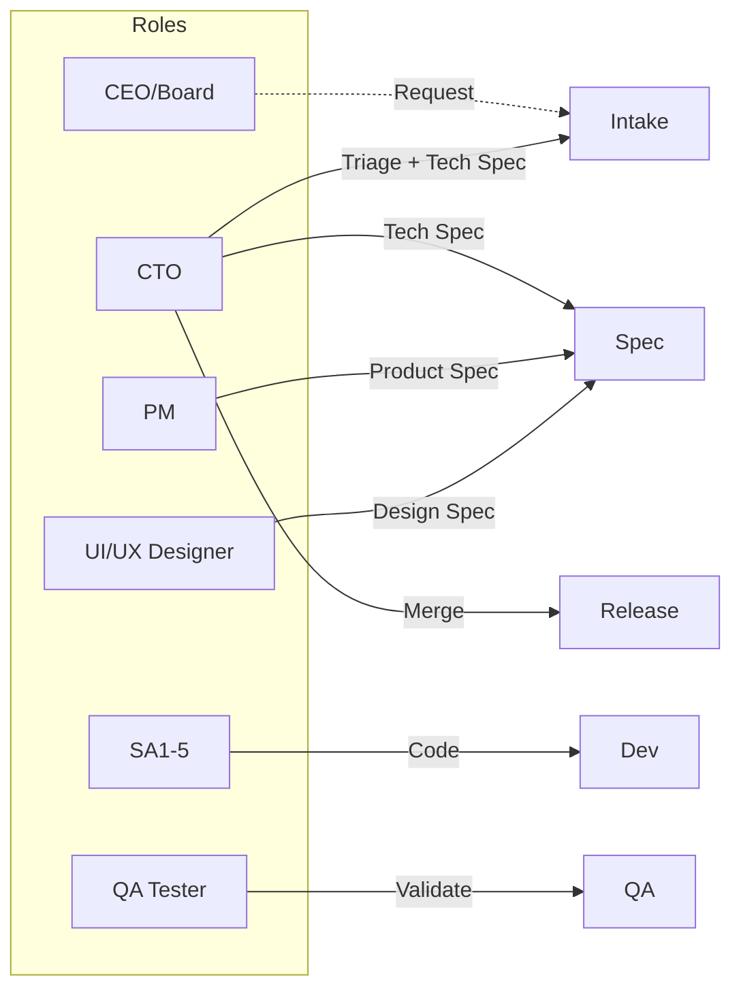

# SDLC Workflow Flowchart — QH Company

> QUA-182 | Version 1.0 | 2026-03-22

## Main Flow

```mermaid
flowchart TD
    START([New Request / Bug / Feature]) --> INTAKE

    subgraph INTAKE["Phase 1: INTAKE"]
        I1[Create Paperclip Issue QUA-xxx]
        I2[Set Priority & Category]
        I3[Assign Owner]
        I1 --> I2 --> I3
    end

    INTAKE --> GATE1{Enough context<br/>for dev?}
    GATE1 -- No --> SPEC
    GATE1 -- Yes, trivial fix --> DEV

    subgraph SPEC["Phase 2: SPEC"]
        S1[CTO: Technical Spec]
        S2[PM: Product Spec]
        S3[UI/UX: Design Spec]
        S4[Define DoD + Scope]
        S1 --> S4
        S2 --> S4
        S3 --> S4
    end

    SPEC --> GATE2{Spec approved<br/>by CTO?}
    GATE2 -- No --> SPEC
    GATE2 -- Yes --> DEV

    subgraph DEV["Phase 3: DEV"]
        D1[SA checkout issue]
        D2[Create branch fix/feat-qua-xxx]
        D3[Implement changes]
        D4[Local tests: tsc + vitest]
        D5[Create PR + comment on issue]
        D1 --> D2 --> D3 --> D4
        D4 --> D4GATE{Tests pass?}
        D4GATE -- No --> D3
        D4GATE -- Yes --> D5
    end

    DEV --> QA

    subgraph QA["Phase 4: QA"]
        Q1[Code review]
        Q2[TypeScript + Test verification]
        Q3[UI/UX/A11Y review if applicable]
        Q4[Security check]
        Q1 --> Q2 --> Q3 --> Q4
    end

    QA --> GATE3{QA Verdict}
    GATE3 -- Changes Requested --> DEV
    GATE3 -- Approved --> RELEASE

    subgraph RELEASE["Phase 5: RELEASE"]
        R1[Merge PR to master]
        R2[Verify build post-merge]
        R3[Push to all remotes]
        R4[Update issue → done]
        R1 --> R2 --> R3 --> R4
    end

    RELEASE --> DONE([Issue Closed])

    style INTAKE fill:#e3f2fd,stroke:#1565c0
    style SPEC fill:#fff3e0,stroke:#e65100
    style DEV fill:#e8f5e9,stroke:#2e7d32
    style QA fill:#fce4ec,stroke:#c62828
    style RELEASE fill:#f3e5f5,stroke:#6a1b9a
```

## Hotfix Flow

```mermaid
flowchart LR
    CRITICAL([Critical Bug]) --> DEV2[SA: Hotfix branch]
    DEV2 --> QUICK_QA[CTO: Quick review]
    QUICK_QA --> MERGE[Merge + Push]
    MERGE --> DONE2([Resolved])

    style CRITICAL fill:#ffcdd2,stroke:#b71c1c
```

## Trách nhiệm theo Phase

```mermaid
graph LR
    subgraph Roles
        CEO[CEO/Board]
        CTO[CTO]
        PM[PM]
        SA[SA1-5]
        QAR[QA Tester]
        UX[UI/UX Designer]
    end

    CEO -.->|Request| INTAKE2[Intake]
    CTO -->|Triage + Tech Spec| INTAKE2
    CTO -->|Tech Spec| SPEC2[Spec]
    PM -->|Product Spec| SPEC2
    UX -->|Design Spec| SPEC2
    SA -->|Code| DEV2[Dev]
    QAR -->|Validate| QA2[QA]
    CTO -->|Merge| REL2[Release]
```
